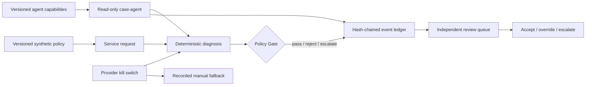

# Rivulet LocalOps

[](https://github.com/Zeeekrom/rivulet-localops/actions/workflows/ci.yml)


Rivulet LocalOps is a portfolio-grade civic workflow demonstrator for explainable and accountable local-government service-request decisions. It connects deterministic triage, a bounded read-only agent, public asset matching, a versioned policy Gate, a tamper-evident event ledger, human review, a provider kill switch and a truth-labelled analytics mart in one reproducible workflow.

This is an independent technical prototype. It is not an official City of Hobart, Tasmanian Government or council service. It contains no real resident requests and performs no real council-system writes.

## Why it exists

Automated classification is only one part of a trustworthy operational workflow. The harder questions are:

- Which approved rule allowed or blocked an action?
- What evidence and software version were used?
- Who was accountable for the decision?
- Can an independent reviewer accept, override or escalate it without erasing history?
- Can an agent use only the current case, approved data and allowlisted tools—and fail closed when its provider identity changes?
- Can automation be stopped safely when integrity or provider concerns arise?

Rivulet LocalOps makes those controls executable and testable.



## Current release: v0.6.0

| Capability | Implemented evidence |
|---|---|
| Explainable diagnosis | Eight operational categories, general fallback, priority rule, confidence, matched terms and missing-information list |
| Public asset context | Nearest-bin matching against a 727-feature City of Hobart public ArcGIS snapshot |
| Policy Gate | Versioned synthetic policy; deterministic `pass`, `reject` and `escalate`; rule-level reasons and policy hash |
| Action boundary | Only `create_draft_work_order` can pass; no connector or external write exists |
| Decision ledger | SQLite append-only events with request, policy and event hashes; provider/evidence/owner/time metadata |
| Human control | Pending queue; separate owner and reviewer; append-only accept/override/escalate history |
| Replay | Recomputes the decision and compares policy version/hash, provider version, category, priority and Gate rules |
| Safety control | Persistent provider kill switch, manual fallback event, integrity failure that stops automated processing |
| Bounded agent control | Server-selected `case-agent`, hash-bound capability registry, five-minute grant, four-call budget, tool/data/resource allowlists, pre-execution provider binding and auditable failure paths |
| Verification | 35 automated tests, a 12-case deterministic regression set and a 12-check F18 capability review; repository checks are reproduced by GitHub Actions |
| Windows reliability | SQLite read connections are explicitly closed; a disposable review runner verifies cleanup after the full review story |
| Public-source contracts | D1 Hobart assets and D2 Townsville monthly aggregate counts have publisher, URL, licence, retrieval, hash, schema, grain and limitation manifests |
| Data quality | 19 automated source checks: 15 pass, 4 documented warnings, 0 fail and 0 blocking |
| Synthetic analytics fixture | D6 deterministically reproduces 316 hash-chained events: 180 decisions, 120 reviews, 8 manual fallbacks and 8 provider-control changes |
| Analytics mart | 14 non-empty dimension/fact tables as versioned CSV plus a reproducible local SQLite build; 8 reconciliation checks pass |
| Metric governance | Numerators, denominators, grain, filters, null handling, truth class and caveats are defined; no unsupported target is invented |
| Power BI assurance | Deterministically generated two-page PBIP/PBIR/TMDL project: 7 Import tables, 29 measures, 8 relationships, 27 visuals, visible truth boundaries and versioned Desktop evidence |

The current diagnosis engine and agent adapter are deliberately rules-based. They form a transparent control baseline for later model comparison and are not presented as generative AI.

## Technology stack

- Python 3.12
- FastAPI and Pydantic contracts
- SQLite event storage using the Python standard library
- SHA-256 canonical event hashing
- GeoJSON and public ArcGIS asset data
- Contracted public CSV data, deterministic JSONL events and a star-schema analytics mart
- Power BI Project (PBIP/PBIR/TMDL) with deterministic generation and Microsoft report validation
- pytest and FastAPI TestClient
- pip-tools lockfile
- GitHub Actions verification

See [Technical Architecture](docs/TECHNICAL_ARCHITECTURE.md) for components, data contracts, controls and limitations. See [Sprint Evidence](docs/SPRINT_EVIDENCE.md) for the completed acceptance checks and claim boundaries.

## Run locally

```powershell
git clone https://github.com/Zeeekrom/rivulet-localops.git
cd rivulet-localops
py -3.12 -m venv .venv
.\.venv\Scripts\python.exe -m pip install -r requirements-dev.lock
.\.venv\Scripts\python.exe -m uvicorn rivulet_localops.main:app --app-dir src --reload
```

Open `http://127.0.0.1:8000/docs` for the interactive API.

Submit a synthetic request:

```json
{
  "request": {
    "text": "The public bin is overflowing beside the footpath on Elizabeth Street",
    "coordinates": {
      "latitude": -42.88675,
      "longitude": 147.31912
    }
  },
  "proposed_action": "create_draft_work_order",
  "accountable_owner_id": "owner.demo"
}
```

Send it to `POST /api/v1/submit`. The response includes the original Gate result, ledger sequence and hashes, policy/provider references, evidence and review state.

## API surface

| Method and path | Purpose |
|---|---|
| `GET /health` | Engine, policy, provider-control and ledger status |
| `POST /api/v1/diagnose` | Explainable diagnosis without creating a decision record |
| `POST /api/v1/submit` | Run diagnosis + Gate and append a decision event |
| `GET /api/v1/decisions` | Query recent decisions or the pending/reviewed queue |
| `GET /api/v1/decisions/{id}` | Read one decision and its review history |
| `POST /api/v1/decisions/{id}/reviews` | Append an independent accept/override/escalate review |
| `POST /api/v1/decisions/{id}/replay` | Compare a replay with recorded evidence |
| `GET /ops/v1/ledger/integrity` | Verify the event hash chain |
| `GET /ops/v1/providers/{id}` | Read provider-control status |
| `POST /ops/v1/providers/{id}/kill-switch` | Disable or re-enable the provider with operator and reason fields |
| `GET /ops/v1/agents/{id}/capabilities` | Inspect the server-selected read-only capability profile |
| `POST /api/v1/agents/case-agent/invoke` | Run one bounded synthetic-case diagnosis without Gate or connector execution |
| `GET /ops/v1/agents/invocations` | Query completed, denied and failed agent audit records |

## Verify

```powershell
.\scripts\verify.ps1
```

Expected release evidence:

- source profile: 19 checks, 0 fail, 0 blocking
- deterministic D6: 316 events with stable SHA-256 and a valid hash chain
- analytics mart: 14 tables and 8 successful reconciliations
- Power BI project: 51 controlled files, 88 structural checks and Microsoft validator 0 errors / 0 warnings
- Power BI Desktop: 7 of 7 Import partitions refreshed and 13 of 13 DAX reference values reconciled
- `35 passed`
- 12 deterministic regression cases with zero category/priority differences
- F18: 12 of 12 capability checks; 7 invocations = 1 completed, 5 denied and 1 failed before execution
- the Sprint 2 review runner completes on Windows without retaining the disposable SQLite files

Run the end-to-end review story separately with:

```powershell
.\.venv\Scripts\python.exe scripts\run_sprint2_review.py
```

The machine-readable review result and its claim boundary are in
[`evidence/F08/2026-09-09`](evidence/F08/2026-09-09/README.md).
Source-quality and analytics evidence are in
[`F06`](evidence/F06/2026-09-09/README.md) and [`F09`](evidence/F09/2026-09-09/README.md). Power BI build, refresh,
reconciliation, screenshots and Desktop round-trip evidence are in
[`F10 initial Review`](evidence/F10/2026-09-10/README.md) and
[`F10 round-trip`](evidence/F10/2026-09-12/README.md). Sprint 3 identity, tool, data, resource, budget and provider-binding
evidence is in [`F18`](evidence/F18/2026-09-12/README.md).

To open the report, run the normal verification first, then open
`analytics/powerbi/RivuletAssurance.pbip` in Power BI Desktop and refresh. PBIP/PBIR are preview formats. After any
Desktop edit or refresh, rerun `scripts/build_powerbi_project.py` before validating or committing; the generator is
the repository's canonical serialization boundary.

The 12-case result is a regression check on self-authored, uncomplicated cases. It is not model-accuracy or real-world effectiveness evidence.

## Security and data boundary

- The API schema accepts only records labelled `synthetic`, but cannot prove entered prose is genuinely synthetic. Do not enter resident or other personal data.
- Owner, reviewer and operator IDs are asserted strings, not authenticated identities. Authentication and RBAC are not yet implemented.
- The `case-agent` identity is selected by the server and its local capability envelope is enforced, but callers are unauthenticated. Current-case checks are a contract demonstration, not object authorization against a real case store.
- The capability registry is versioned and hashed but not signed. Input hashes are not privacy-preserving commitments; only synthetic requests are permitted.
- No external model API or model credential is used. The agent runs the deterministic-rules baseline and does not execute the Gate, a human decision or a connector.
- The hash chain detects in-place modification, reordering and gaps. It is not an external signature, WORM store or production audit guarantee.
- The operations endpoint is logically separate but runs in the same application process; it is not yet an out-of-band control plane.
- No endpoint writes to a real business system.
- Townsville data is monthly aggregate reference context, not Hobart demand or individual requests.
- Every D6 decision, review, actor, time and operational metric is fixed-seed synthetic data. Its rates exercise calculations and are not council performance or model-accuracy evidence.

## Next verified slice

The next planned slice is adversarial and secure-delivery verification: ambiguous and injection-style inputs,
cross-case/provider-outage paths, secret scanning, static/dependency analysis, an SBOM and recovery evidence.
Authentication/RBAC, Windows enterprise lab integration, PostgreSQL and Azure deployment remain later stages and are
not represented as completed.
