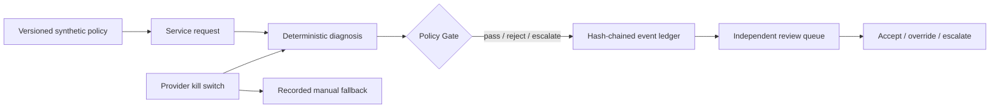

# Rivulet LocalOps

[](https://github.com/Zeeekrom/rivulet-localops/actions/workflows/ci.yml)


Rivulet LocalOps is a portfolio-grade civic workflow demonstrator for explainable and accountable local-government service-request decisions. It connects deterministic triage, public asset matching, a versioned policy Gate, a tamper-evident event ledger, human review and a provider kill switch in one reproducible workflow.

This is an independent technical prototype. It is not an official City of Hobart, Tasmanian Government or council service. It contains no real resident requests and performs no real council-system writes.

## Why it exists

Automated classification is only one part of a trustworthy operational workflow. The harder questions are:

- Which approved rule allowed or blocked an action?
- What evidence and software version were used?
- Who was accountable for the decision?
- Can an independent reviewer accept, override or escalate it without erasing history?
- Can automation be stopped safely when integrity or provider concerns arise?

Rivulet LocalOps makes those controls executable and testable.



## Current release: v0.3.0

| Capability | Implemented evidence |
|---|---|
| Explainable diagnosis | Eight operational categories, general fallback, priority rule, confidence, matched terms and missing-information list |
| Public asset context | Nearest-bin matching against a 727-feature City of Hobart public ArcGIS snapshot |
| Policy Gate | Versioned synthetic policy; deterministic `pass`, `reject` and `escalate`; rule-level reasons and policy hash |
| Action boundary | Only `create_draft_work_order` can pass; no connector or external write exists |
| Decision ledger | SQLite append-only events with request, policy and event hashes; provider/evidence/owner/time metadata |
| Human control | Pending queue; separate owner and reviewer; append-only accept/override/escalate history |
| Replay | Recomputes the decision and compares policy version/hash, provider version, category, priority and Gate rules |
| Safety control | Persistent provider kill switch, manual fallback event, integrity failure that stops automated processing |
| Verification | 18 automated tests plus a 12-case deterministic regression set |

The current diagnosis engine is deliberately rules-based. It is a transparent control baseline for later model comparison and is not presented as generative AI.

## Technology stack

- Python 3.12
- FastAPI and Pydantic contracts
- SQLite event storage using the Python standard library
- SHA-256 canonical event hashing
- GeoJSON and public ArcGIS asset data
- pytest and FastAPI TestClient
- pip-tools lockfile
- GitHub Actions verification

See [Technical Architecture](docs/TECHNICAL_ARCHITECTURE.md) for components, data contracts, controls and limitations. See [Sprint Evidence](docs/SPRINT_EVIDENCE.md) for the completed acceptance checks and claim boundaries.

## Run locally

```powershell
git clone https://github.com/Zeeekrom/rivulet-localops.git
cd rivulet-localops
py -3.12 -m venv .venv
.\.venv\Scripts\python.exe -m pip install -r requirements-dev.lock
.\.venv\Scripts\python.exe -m uvicorn rivulet_localops.main:app --app-dir src --reload
```

Open `http://127.0.0.1:8000/docs` for the interactive API.

Submit a synthetic request:

```json
{
  "request": {
    "text": "The public bin is overflowing beside the footpath on Elizabeth Street",
    "coordinates": {
      "latitude": -42.88675,
      "longitude": 147.31912
    }
  },
  "proposed_action": "create_draft_work_order",
  "accountable_owner_id": "owner.demo"
}
```

Send it to `POST /api/v1/submit`. The response includes the original Gate result, ledger sequence and hashes, policy/provider references, evidence and review state.

## API surface

| Method and path | Purpose |
|---|---|
| `GET /health` | Engine, policy, provider-control and ledger status |
| `POST /api/v1/diagnose` | Explainable diagnosis without creating a decision record |
| `POST /api/v1/submit` | Run diagnosis + Gate and append a decision event |
| `GET /api/v1/decisions` | Query recent decisions or the pending/reviewed queue |
| `GET /api/v1/decisions/{id}` | Read one decision and its review history |
| `POST /api/v1/decisions/{id}/reviews` | Append an independent accept/override/escalate review |
| `POST /api/v1/decisions/{id}/replay` | Compare a replay with recorded evidence |
| `GET /ops/v1/ledger/integrity` | Verify the event hash chain |
| `GET /ops/v1/providers/{id}` | Read provider-control status |
| `POST /ops/v1/providers/{id}/kill-switch` | Disable or re-enable the provider with operator and reason fields |

## Verify

```powershell
.\scripts\verify.ps1
```

Expected release evidence:

- `18 passed`
- 12 deterministic regression cases with zero category/priority differences

The 12-case result is a regression check on self-authored, uncomplicated cases. It is not model-accuracy or real-world effectiveness evidence.

## Security and data boundary

- The API schema accepts only records labelled `synthetic`, but cannot prove entered prose is genuinely synthetic. Do not enter resident or other personal data.
- Owner, reviewer and operator IDs are asserted strings, not authenticated identities. Authentication and RBAC are not yet implemented.
- The hash chain detects in-place modification, reordering and gaps. It is not an external signature, WORM store or production audit guarantee.
- The operations endpoint is logically separate but runs in the same application process; it is not yet an out-of-band control plane.
- No endpoint writes to a real business system.

## Next verified slice

The next planned slice is a small analytics model using real public reference dimensions and explicitly synthetic operational facts, followed by a Power BI provenance and decision-control view. Authentication/RBAC, adversarial evaluation, Windows enterprise lab integration and Azure deployment remain later stages and are not represented as completed.
