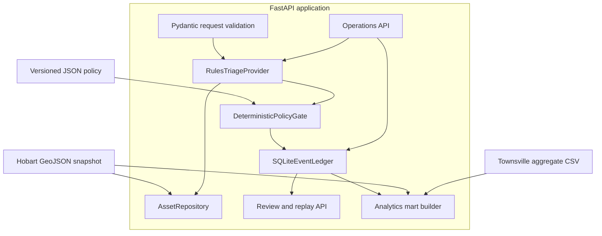
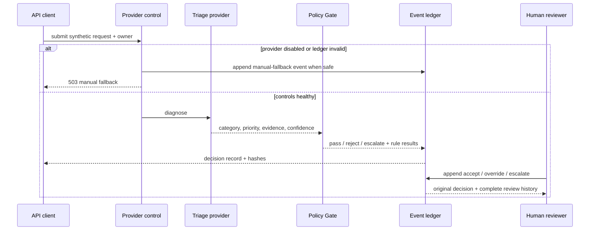

# Technical Architecture

Status: implemented local release v0.4.1. Planned capabilities are marked explicitly.

## 1. System boundary

Rivulet LocalOps currently runs as one local FastAPI process with three logical areas:

1. decision support: request validation, deterministic classification, priority and asset match;
2. governance: versioned policy pack, deterministic Gate, decision/review ledger and replay;
3. operations: health, ledger-integrity verification and provider kill switch.

SQLite is the current local event store. D1/D2 public snapshots and the D6 synthetic event export feed a reproducible
SQLite/CSV analytics mart. There is no web frontend, authenticated identity provider, external business connector,
PostgreSQL service, Power BI report or cloud deployment in this release.

## 2. Submission sequence

## 3. Policy and deterministic Gate

The active pack is `data/policies/waste_litter_demo_v0.1.0.json`. Its schema requires:

- explicit `approved_for_demo` state;
- `is_synthetic: true`;
- human product-owner authority metadata;
- policy ID, version and timezone-aware approval time;
- category scope, permitted actions, evidence rules and thresholds.

The Gate evaluates six visible rules:

| Rule | Check | Failure effect |
|---|---|---|
| `POL-SCOPE-001` | Category is `waste_litter` | Escalate |
| `POL-ACTION-001` | Action is `create_draft_work_order` | Reject |
| `POL-LOCATION-001` | Latitude and longitude supplied | Reject |
| `POL-ASSET-001` | Eligible public litter-bin asset within policy radius | Escalate |
| `POL-SAFETY-001` | Priority does not require emergency escalation | Escalate |
| `POL-CONFIDENCE-001` | Category confidence meets threshold | Escalate |
| `POL-REVIEW-001` | Diagnosis has no human-review flag | Escalate |

Escalation takes precedence when a request has both rejection and escalation reasons. A passing result means only that the proposed draft action satisfies this demonstration policy. It does not execute the action.

The policy reference includes a SHA-256 hash of its canonical parsed content. This exposes a same-version content change during replay instead of trusting the version label alone.

## 4. Event ledger

The ledger uses one append-only `ledger_events` table. Event types currently include:

- `decision.created`
- `decision.reviewed`
- `decision.replayed`
- `decision.manual_fallback`
- `provider.control_changed`

Every event stores:

| Envelope field | Purpose |
|---|---|
| `sequence` | Monotonic local ordering |
| `event_id` | Unique event identity |
| `event_type` | Immutable event meaning |
| `occurred_at` | UTC event time |
| `actor_id` | System, reviewer or operator assertion |
| `correlation_id` | Workflow trace key |
| `entity_id` | Decision or provider-control identity |
| `payload_json` | Canonical event data |
| `previous_event_hash` | Link to preceding global event |
| `event_hash` | SHA-256 of the complete canonical envelope |

The event hash is calculated over the sequence, IDs, type, time, actor, correlation, entity, parsed payload and previous hash. Before an append, the existing chain is verified inside an immediate SQLite transaction. A failure blocks the append. Automated diagnosis and decision APIs also fail closed when chain verification fails; `/health` reports `degraded` and the integrity endpoint remains available for investigation.

This mechanism is tamper-evident, not immutable. An operator with filesystem control could replace the whole database and application. A production design would add access controls, signed checkpoints, protected backup/retention and an independently secured audit destination.

## 5. Decision record

A `decision.created` payload includes:

- synthetic request snapshot and request hash;
- accountable owner assertion;
- data truth class, source and environment;
- proposed action;
- policy ID, version and content hash;
- provider, provider version and execution mode;
- matched terms and public asset evidence;
- explicit tool-call list, currently empty;
- complete Gate decision, explanations and rule outcomes.

Review events never update that payload. The API assembles the original decision with ordered review history at read time.

## 6. Human review boundary

The review API accepts `accept`, `override` or `escalate` with a reviewer ID and reason. An override must include a corrected category, corrected priority or replacement action. It records human judgement but does not execute the replacement.

Two deterministic separation controls apply:

- the accountable owner cannot review the same decision;
- a Gate-rejected or Gate-escalated decision cannot be directly accepted—reviewers must override or escalate with an explicit reason.

These are application controls, not identity assurance. The IDs are not authenticated in v0.4.1.

## 7. Replay

Replay reconstructs the original request and proposed action, runs the current provider and Gate, and compares:

- policy version and canonical content hash;
- provider version;
- Gate status;
- category and priority;
- ordered rule IDs, outcomes and effects.

The comparison itself is appended as a `decision.replayed` event. Replay demonstrates deterministic reproducibility under the currently loaded code and data; it is not proof that every external dependency or future software version is reproducible.

## 8. Kill switch and manual fallback

Provider-control changes are append-only events containing the operator assertion, reason, time and disabled state. The latest valid event determines current state and survives application restart.

When disabled:

- `/api/v1/diagnose` returns HTTP 503 with a manual-fallback response;
- `/api/v1/submit` does not invoke automated diagnosis and records a hashed manual-fallback event;
- replay is unavailable;
- historical review remains possible while ledger integrity is valid.

The current kill switch is logically separated under `/ops/v1`, but it is not physically out-of-band because it shares the application process and SQLite file.

## 9. Analytics contracts and mart

D1 City of Hobart assets, D2 Townsville monthly request aggregates and D6 fixed-seed synthetic ledger events each
have a machine-readable source manifest. The manifest pins publisher, URLs, licence, retrieval time, hash, row/event
count, grain, schema, encoding/CRS, truth class and limitations.

The build creates 14 tables. Primary facts are one D2 publisher row, one synthetic decision, one decision × Gate rule,
one synthetic review, one synthetic manual fallback and one source-quality check. D2 categories use a code-plus-label
variant key because historical codes do not map consistently to one label. A source-row key preserves the one
case-normalized business-key collision rather than silently merging its counts.

`real_public_reference` and `synthetic_operational` are separate fact-level truth classes. The build fails on manifest
hash drift, blocking source checks, primary/FK failures, count reconciliation errors, non-contiguous D6 sequence or
truth-class mixing. See the [data dictionary](../analytics/DATA_DICTIONARY.md) and
[metric dictionary](../analytics/metric_dictionary.csv).

## 10. Technology status

| Area | Current | Planned, not implemented |
|---|---|---|
| Application | Python 3.12, FastAPI, Pydantic | Web review experience |
| Decision engine | Deterministic rules provider | Bounded model-provider comparison |
| Operational store | SQLite append-only events | PostgreSQL, migrations and retention controls |
| Data | Contracted Hobart GeoJSON + Townsville aggregate CSV + fixed-seed synthetic JSONL | Additional sources only when a report field requires them |
| Analytics | Reproducible 14-table SQLite/CSV mart, quality checks and metric dictionary | Power BI semantic model and refresh |
| Identity | Validated asserted IDs | Authentication, RBAC and service identities |
| Security | Gate, hash chain, separation checks, kill switch, negative tests | Signed audit checkpoints, SAST/SCA, adversarial evaluation, backup/restore drill |
| Delivery | Lockfile, verification script, GitHub Actions workflow | Protected environments and cloud deployment |

## 11. Primary limitations

- The schema can require a `synthetic` label but cannot determine whether prose contains real personal information.
- Self-authored regression cases do not establish real-world accuracy.
- SQLite is suitable for the current local demonstrator, not a multi-node production service.
- Asserted identity fields do not prevent impersonation.
- No connector means no action is executed and no downstream receipt exists.
- No real council has validated the policy, workflow or operational fit.
- D2 is Townsville aggregate context, not Hobart operational demand; D6 metrics are designed fixtures, not measured performance.
